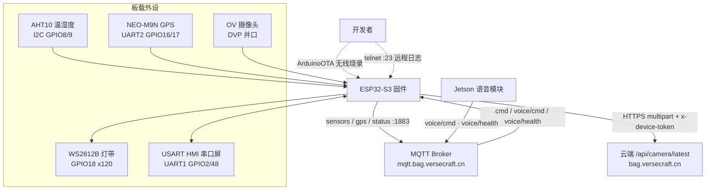

# smart-bag-esp32

> ESP32-S3 智能书包主控固件：温湿度 / GPS / 摄像头抓拍 / 串口屏 UI + MQTT 遥测与命令 + ArduinoOTA 无线烧录。


## 这是什么

这是「智能书包 / VerseCraft」项目的**主控固件**，运行在一块 ESP32-S3 开发板上，把普通书包变成一个联网的边缘设备：周期性采集**温湿度**与 **GPS 位置**，用摄像头**定时抓拍上传**，在串口屏上显示传感器数据 / 课表 / 实时时钟，并通过 **MQTT** 把遥测推到云端、接收来自网页和语音助手的下行控制命令。

固件还内置了一套远程联调能力——一次 USB 烧录之后，后续可经 WiFi **OTA 无线刷固件**，并通过 **telnet（端口 23）** 远程查看运行日志，无需再插数据线。它与同项目的 Jetson 语音模块（`v5/bag/voice/*` 主题）联动，实现「就近告警」与语音状态上屏。

## ✨ 核心特性

- **温湿度采集（AHT10）**：I2C 直驱（100kHz），自带总线恢复（SDA 卡死时手动脉冲 SCL 释放）与最多三次重试初始化；读数越界或读取失败时上报哨兵值 `9999`，避免把脏数据当真实温度。
- **GPS 定位（NEO-M9N）**：基于 TinyGPSPlus 解析，独占 UART2（38400 baud）；定位超时（10s）后经纬度归零，室内无定位时屏幕复用该区域显示 NTP 实时时钟。
- **摄像头抓拍上传（esp_camera）**：VGA JPEG，经 HTTPS multipart 上传到云端 `/api/camera/latest`，携带 `x-device-token` 鉴权；默认 30s 限速，连续失败 3 次触发深度复位（反初始化 + 拉低 RESET 引脚 + 重置 SCCB 总线）。
- **MQTT 遥测与命令（PubSubClient）**：上报 `sensors` / `gps` / `status` 三类主题；非阻塞重连（断线时每 3s 单次尝试，绝不冻结主循环）；带 LWT 遗嘱（断线后 broker 保留 `offline`）+ retained `online` 状态，保证仪表盘任意时刻连上都能正确判定在线。
- **下行命令控制**：通过 `v5/bag/cmd` 接收 `screen_text` / `mode_switch` / `indicator` / `set_timetable` / `screen_raw` / `screen_probe` 等命令并回 ACK；课表可由网页动态下发，不再写死在固件里。
- **串口屏 UI（USART HMI / TJC）**：UART1 驱动，显示温湿度、灯光、GPS/时钟、WiFi、课表，并处理屏幕按钮（开灯 / 关灯 / 拍照）；数值按区间做颜色编码（RGB565 科技蓝主题），故障时红字提示。
- **氛围灯（WS2812B / FastLED）**：120 颗灯珠，支持常亮 / 呼吸 / 流苏追逐（带余晖拖尾），承担专注/普通模式指示与故障红闪告警。
- **远程联调（OTA + telnet）**：ArduinoOTA 口令保护的无线烧录 + telnet 远程日志镜像，WiFi 就绪后懒初始化，大幅缩短现场调试回路。
- **就近告警与语音联动**：订阅 Jetson 的 `voice/health`（retained），麦克风故障时屏幕红字「麦克风坏了」+ LED 红闪；`voice/cmd` 驱动「聆听 / 思考 / 待命」指示灯并同步上屏。

## 🏗 架构



数据流：外设采集 → 主循环每 10s 上报 MQTT 并刷新屏幕；摄像头按 30s 限速抓拍上传；下行命令（网页 / 语音）经 broker 推送到固件，驱动屏幕、LED 与模式切换。

## 🧰 技术栈

| 维度 | 选型 | 说明 |
| --- | --- | --- |
| MCU / 平台 | ESP32-S3 | 主控，WiFi STA 模式 |
| 框架 | Arduino (ESP32 core) | 单 `.ino` sketch 入口 |
| 语言 | C++ | 模块化 `.cpp` / `.h` |
| 遥测协议 | MQTT (PubSubClient) | `mqtt.bag.versecraft.cn:1883`，带鉴权 / LWT / retained |
| 温湿度 | AHT10 (Wire / I2C) | 100kHz，含总线恢复 |
| 定位 | NEO-M9N (TinyGPSPlus) | UART2 @ 38400 |
| 摄像头 | esp_camera + WiFiClientSecure / HTTPClient | VGA JPEG，HTTPS multipart 上传 |
| 灯效 | FastLED | WS2812B / GRB / 120 LED |
| 显示 | USART HMI (TJC) 串口屏 | UART1 @ 115200，TJC 指令协议 |
| 远程更新 | ArduinoOTA | 口令保护，主机名 `smart-bag-esp32.local` |
| 远程日志 | telnet (WiFiServer) | 端口 23，日志双写串口 + telnet |
| 校时 | NTP (configTime) | 东八区，阿里 / 腾讯 / pool 备援 |

## 🚀 快速开始

### 前置依赖

- **硬件**：ESP32-S3 开发板、AHT10、NEO-M9N GPS、OV 系列摄像头模组、WS2812B 灯带、USART HMI（TJC）串口屏。
- **工具链**：Arduino IDE（或 arduino-cli），安装 **ESP32 Arduino core**。
- **Arduino 库**：`PubSubClient`、`TinyGPSPlus`、`FastLED`；`esp_camera`、`ArduinoOTA`、`WiFi`、`WiFiClientSecure`、`HTTPClient`、`Wire` 由 ESP32 core 内置。

### 获取代码

```bash
git clone https://github.com/bei666qi-pan/smart-bag-esp32.git
cd smart-bag-esp32
```

### 配置凭据

固件从 `secrets.h` 读取 WiFi / MQTT / 设备令牌等敏感信息，该文件已被 `.gitignore` 排除、不入库。复制模板并填入真实值：

```bash
cp secrets.h.example secrets.h
# 编辑 secrets.h，填入你的 WiFi、MQTT 账号密码、设备令牌、OTA 口令
```

### 编译与烧录

1. 用 Arduino IDE 打开 `esp32代码.ino`。
2. 开发板选择对应的 ESP32-S3 型号，按需开启 PSRAM（摄像头需要）。
3. 首次用 **USB** 编译上传。

> 入口 `esp32代码.ino` 通过 `#include` 直接引入各 `Hardware/*.cpp`，因此 Arduino IDE 内仅需打开该 sketch 即可整体编译。

### 无线烧录与远程日志

首次烧录含 OTA 的固件后，后续可走无线：

```bash
# 设备会以 smart-bag-esp32.local 出现在 Arduino IDE 的「网络端口」
# 也可用 espota.py / arduino-cli 走网络协议上传；或用 telnet 看实时日志：
telnet <esp32-ip> 23
```

## ⚙️ 配置

所有密钥通过 `secrets.h`（由 `secrets.h.example` 复制而来）注入，**请勿提交真实值**：

| 宏 | 用途 |
| --- | --- |
| `SECRET_WIFI_SSID` / `SECRET_WIFI_PASS` | WiFi 名称与密码 |
| `SECRET_MQTT_USER` / `SECRET_MQTT_PASS` | MQTT broker 鉴权账号（板载专用账号，可写 sensors/status/gps） |
| `SECRET_DEVICE_TOKEN` | 摄像头上传的 `x-device-token` |
| `SECRET_OTA_PASSWORD` | ArduinoOTA 无线烧录口令（置空字符串则不校验） |

其余非敏感参数直接在源码中定义，可按需修改：

| 参数 | 位置 | 默认值 |
| --- | --- | --- |
| MQTT 服务器 / 端口 | `MQTT.cpp`（`MQTT_HOST` / `MQTT_PORT`） | `mqtt.bag.versecraft.cn` / `1883` |
| 上报间隔 | `MQTT.h`（`INTERVAL`） | `10`（秒） |
| 摄像头上传地址 | `Hardware/camera.cpp`（`serverUrl`） | `https://bag.versecraft.cn/api/camera/latest` |
| 摄像头上传间隔 | `Hardware/camera.cpp`（`uploadInterval`） | `30000`（毫秒） |
| OTA 主机名 | `Hardware/OTAUpdate.h`（`OTA_HOSTNAME`） | `smart-bag-esp32` |
| telnet 端口 | `Hardware/RemoteDebug.h`（`TELNET_PORT`） | `23` |

### MQTT 主题

| 主题 | 方向 | 内容 |
| --- | --- | --- |
| `v5/bag/sensors` | ↑ 上报 | `{"temp":..,"humid":..}` |
| `v5/bag/gps` | ↑ 上报 | `{"lat":..,"lng":..}` |
| `v5/bag/status` | ↑ 上报（retained / LWT） | `{"status":"online"\|"offline"}` |
| `v5/bag/cmd` | ↓ 命令 | `{"id":..,"action":..,"value":..}` |
| `v5/bag/cmd/ack` | ↑ 回执 | `{"cmd_id":..,"status":..,"msg":..}` |
| `v5/bag/voice/cmd` | ↓ 语音控制 | 来自 Jetson，无 id 故不回 ACK |
| `v5/bag/voice/health` | ↓ 健康态（retained） | 麦克风健康 / 故障，触发就近告警 |

## 📁 目录结构

```
smart-bag-esp32/
├── esp32代码.ino           # 入口 sketch：setup/loop，聚合各模块
├── MQTT.cpp / MQTT.h        # WiFi 连接、MQTT 上报/重连/下行命令分发
├── secrets.h.example        # 凭据模板（复制为 secrets.h 后填值，不入库）
├── chuankou Project.HMI     # USART HMI(TJC) 串口屏工程文件（二进制）
├── .gitignore               # 排除 secrets.h / .DS_Store
└── Hardware/
    ├── AHT10.cpp/.h         # 温湿度传感器（I2C + 总线恢复）
    ├── NEO_M9N.cpp/.h       # GPS（TinyGPSPlus / UART2）
    ├── camera.cpp/.h        # 摄像头抓拍 + HTTPS 上传 + 故障复位
    ├── LED.cpp/.h           # WS2812B 灯效（常亮/呼吸/追逐）
    ├── Screen.cpp/.h        # 串口屏 UI、按钮事件、课表、告警
    ├── OTAUpdate.cpp/.h     # ArduinoOTA 无线烧录
    └── RemoteDebug.cpp/.h   # telnet 远程日志（端口 23）
```

## 关联仓库

本固件是「智能书包 / VerseCraft」系统的一部分，与以下模块协同：

- **语音模块（Jetson）**：经 `v5/bag/voice/*` 主题与本固件联动，实现语音控制与就近告警。
- **云端 / 网页**：接收遥测、下发命令、接收摄像头抓拍（`bag.versecraft.cn`）。

## 许可证

仓库未声明许可证（无 LICENSE 文件）。如需复用，请先与作者确认授权方式。
